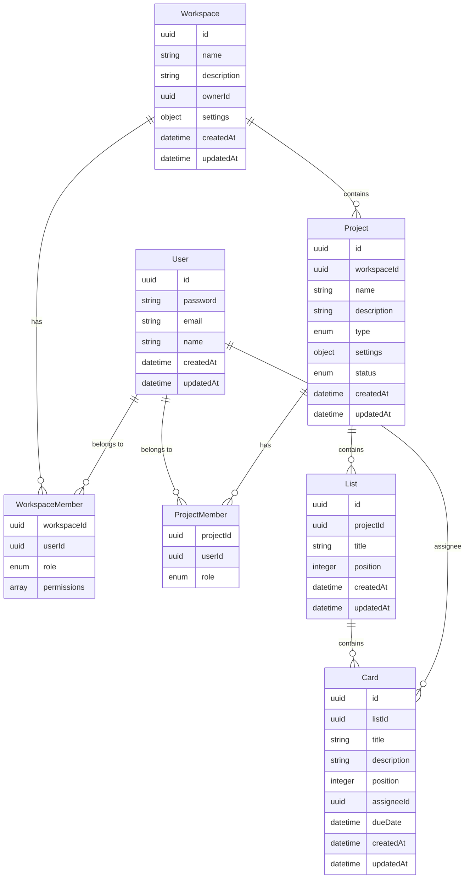

---
title: ERD
---

[//]: # (https://agramont.net/blog/diagraming-with-mermaidjs-astro/)
[//]: # (https://mermaid.js.org/syntax/entityRelationshipDiagram.html)

```mermaid
erDiagram
    Workspace ||--o{ Project : "contains"
    Workspace ||--o{ WorkspaceMember : "has"
    User ||--o{ WorkspaceMember : "belongs to"
    User ||--o{ ProjectMember : "belongs to"
    Project ||--o{ ProjectMember : "has"
    Project ||--o{ List : "contains"
    List ||--o{ Card : "contains"
    User ||--o{ Card : "assignee"

    Workspace {
        uuid id
        string name
        string description
        uuid ownerId
        object settings
        datetime createdAt
        datetime updatedAt
    }

    WorkspaceMember {
        uuid workspaceId
        uuid userId
        enum role
        array permissions
    }

    Project {
        uuid id
        uuid workspaceId
        string name
        string description
        enum type
        object settings
        enum status
        datetime createdAt
        datetime updatedAt
    }

    ProjectMember {
        uuid projectId
        uuid userId
        enum role
    }

    List {
        uuid id
        uuid projectId
        string title
        integer position
        datetime createdAt
        datetime updatedAt
    }

    Card {
        uuid id
        uuid listId
        string title
        string description
        integer position
        uuid assigneeId
        datetime dueDate
        datetime createdAt
        datetime updatedAt
    }

    User {
        uuid id
        string password
        string email
        string name
        datetime createdAt
        datetime updatedAt
    }
```