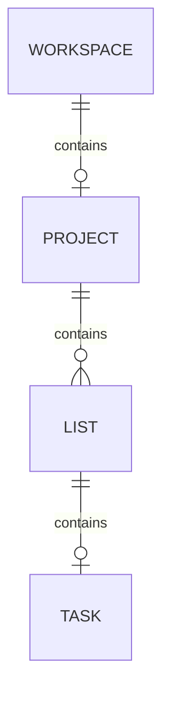
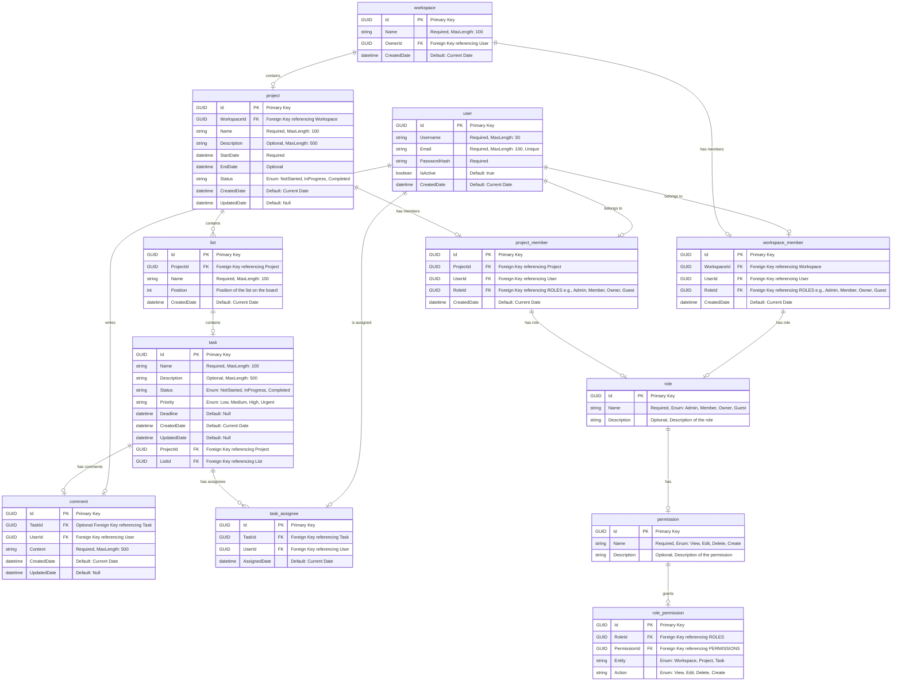

---
title: ERD Documentation
---

[//]: # (https://agramont.net/blog/diagraming-with-mermaidjs-astro/)
[//]: # (https://mermaid.js.org/syntax/entityRelationshipDiagram.html)

### Introduction
The Entity Relationship Diagram (ERD) provides a visual representation of the database schema and the relationships between the entities. The ERD helps to understand the structure of the database and the connections between the tables.

### Project Management Entity Relationship Diagram
The following diagram illustrates the relationships between the entities in the application:

### Database Relationships Diagram
The following diagram illustrates the relationships between the entities in the database model:

### Database Entities Definition

| Entity               | Description                                                         |
|----------------------|---------------------------------------------------------------------|
| **user**             | Represents an individual user in the application.                  |
| **workspace**        | Represents a workspace that organizes projects and members. A workspace is owned by a single user.       |
| **project**          | Represents a project within a workspace, containing tasks and other project-related data. |
| **list**             | Represents a list within a project, where tasks can be organized. List in Zello is also a kanban column that contains tasks.              |
| **task**             | Represents an individual task within a project and list.           |
| **comment**          | Represents a comment made by a user on a task.                     |
| **workspace_member** | Represents a user's membership in a workspace with a specific role. |
| **project_member**   | Represents a user's membership in a project with a specific role. |
| **task_assignee**    | Represents the assignment of a task to a user.                     |
| **role**             | Represents a role that defines a user's permissions in a workspace or project. A role can be Admin, Member, Owner or Guest |
| **permission**       | Represents a specific action or right that can be granted to a role. |
| **role_permission**  | Represents the assignment of a permission to a role for specific actions on an entity. |

### Database Relationship Summary

| Entities                            | Relationship Type | Description                                                                                                                                        |
|-------------------------------------|-------------------|----------------------------------------------------------------------------------------------------------------------------------------------------|
| `user ↔ workspace_member`           | One-to-Many       | A user can be a member of multiple workspaces, but each workspace member corresponds to only one user.                                             |
| `user ↔ project_member`             | One-to-Many       | A user can be a member of multiple projects, but each project member corresponds to only one user.                                                 |
| `user ↔ comment`                    | One-to-Many       | A user can write multiple comments, but each comment is associated with a single user.                                                             |
| `user ↔ task_assignee`              | One-to-Many       | A user can be assigned multiple tasks, but each task assignee corresponds to only one user.                                                        |
| `workspace ↔ workspace_member`      | One-to-Many       | A workspace can have multiple members, but each workspace member corresponds to only one workspace.                                                |
| `workspace ↔ project`               | One-to-Many       | A workspace can contain multiple projects, but each project belongs to only one workspace.                                                         |
| `project ↔ project_member`          | One-to-Many       | A project can have multiple members, but each project member corresponds to only one project.                                                      |
| `project ↔ list`                    | One-to-Many       | A project can contain multiple lists, but each list belongs to only one project.                                                                   |
| `list ↔ task`                       | One-to-Many       | A list can contain multiple tasks, but each task belongs to only one list.                                                                         |
| `task ↔ task_assignee`              | One-to-Many       | A task can have multiple assignees, but each task assignee corresponds to only one task.                                                           |
| `task ↔ comment`                    | One-to-Many       | A task can have multiple comments, but each comment corresponds to only one task.                                                                  |
| `workspace_member ↔ role`           | Many-to-One       | A workspace member is assigned a specific role, but each role can be assigned to multiple members within a workspace.                              |
| `project_member ↔ role`             | Many-to-One       | A project member is assigned a specific role, but each role can be assigned to multiple members within a project.                                  |
| `role ↔ permission`                 | Many-to-Many      | A role can have multiple permissions, and a permission can be assigned to multiple roles, facilitated by `role_permission`.                       |
| `permission ↔ role_permission`      | One-to-Many       | A permission can be referenced by multiple `role_permission` entries, each mapping a permission to a role for specific actions on entities.       |
