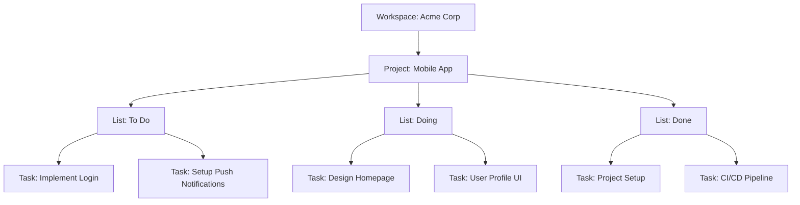

```mermaid
graph TD
    W[Workspace: Acme Corp] --> P[Project: Mobile App]

    P --> L1[List: To Do]
    P --> L2[List: Doing]
    P --> L3[List: Done]

    L1 --> T1[Task: Implement Login]
    L1 --> T2[Task: Setup Push Notifications]

    L2 --> T3[Task: Design Homepage]
    L2 --> T4[Task: User Profile UI]

    L3 --> T5[Task: Project Setup]
    L3 --> T6[Task: CI/CD Pipeline]
```