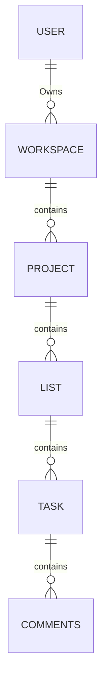
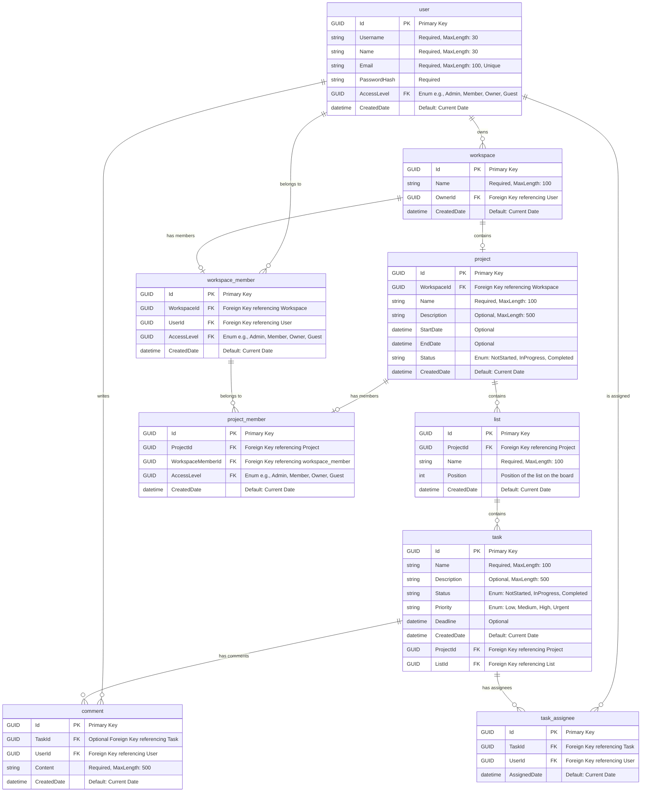

# Zello

A task management system built with .NET 8 and PostgreSQL. Inspired by Trello, Zello allows teams to organize projects using boards, lists, and cards.

For additional documentation visit: [Zello Documentation](https://kelo221.github.io/fs19_CSharp_Teamwork/)

Server has been deployed on https://zello123-b0bracfcbsgaa5gp.northeurope-01.azurewebsites.net
## Features
- User authentication and authorization with JWT
- Workspaces for team organization
- Project management with customizable task lists
- Task tracking with comments and assignments
- Role-based access control (Guest, Member, Owner, Admin)

## Quick Start
1. Ensure PostgreSQL is installed and running
2. Update the connection string in your configuration
3. Run the application - the database will be automatically created and seeded with sample data

## Default Users
- Admin: username: `admin1234`, password: `admin1234`
- Owner: username: `johnjohn`, password: `johnjohn`
- Member: username: `janejane`, password: `janejane`

## ERD

### Database Entities Definition

| Entity               | Description                                                         |
|----------------------|---------------------------------------------------------------------|
| **user**             | Represents an individual user in the application.                  |
| **workspace**        | Represents a workspace that organizes projects and members. A workspace is owned by a single user.       |
| **project**          | Represents a project within a workspace, containing tasks and other project-related data. |
| **list**             | Represents a list within a project, where tasks can be organized. List in Zello is also a kanban column that contains tasks.              |
| **task**             | Represents an individual task within a project and list.           |
| **comment**          | Represents a comment made by a user on a task.                     |
| **workspace_member** | Represents a user's membership in a workspace with a specific role. |
| **project_member**   | Represents a user's membership in a project with a specific role. |
| **task_assignee**    | Represents the assignment of a task to a user.                     |
| **role**             | Represents a role that defines a user's permissions in a workspace or project. A role can be Admin, Member, Owner or Guest |

### Database Relationship Summary

| Entities                          | Relationship Type | Description                                                                                                   |
|-----------------------------------|-------------------|---------------------------------------------------------------------------------------------------------------|
| `user` ↔ `workspace_member`       | One-to-Many       | A user can be a member of multiple workspaces, but each workspace member corresponds to only one user.        |
| `user` ↔ `workspace`              | One-to-Many       | A user can own multiple workspaces, but each workspace is owned by a single user.                             |
| `user` ↔ `comment`                | One-to-Many       | A user can write multiple comments, but each comment is written by one user.                                  |
| `user` ↔ `task_assignee`          | One-to-Many       | A user can be assigned to multiple tasks, but each task assignment references one user.                       |
| `workspace` ↔ `workspace_member`  | One-to-Many       | A workspace can have multiple members, but each membership references one workspace.                          |
| `workspace` ↔ `project`           | One-to-Many       | A workspace can contain multiple projects, but each project belongs to one workspace.                         |
| `project` ↔ `project_member`      | One-to-Many       | A project can have multiple members, but each project membership references one project.                      |
| `workspace_member` ↔ `project_member` | One-to-Many    | A workspace member can belong to multiple projects, but each project member references one workspace member.  |
| `project` ↔ `list`                | One-to-Many       | A project can contain multiple lists, but each list belongs to one project.                                   |
| `list` ↔ `task`                   | One-to-Many       | A list can contain multiple tasks, but each task belongs to one list.                                         |
| `task` ↔ `task_assignee`          | One-to-Many       | A task can have multiple assignees, but each task assignment references one task.                             |
| `task` ↔ `comment`                | One-to-Many       | A task can have multiple comments, but each comment references one task.                                      |
